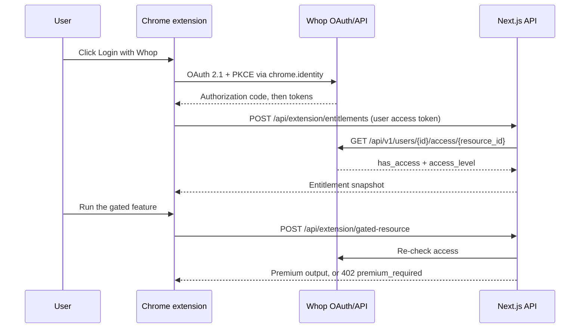

# Paid Chrome Extension with Whop

A Manifest V3 Chrome extension that sells a premium feature through Whop. The extension is a thin client; a Next.js app is the trusted backend; Whop owns login, checkout, billing, and access. The extension never decides access on its own — it holds a Whop OAuth token, and the server re-checks the user's membership with Whop before returning anything paid.

This is the companion repo for the Whop tutorial of the same name. A condensed, LLM-ready build guide lives in [`docs/paid-chrome-extension.md`](docs/paid-chrome-extension.md).

## Structure

A pnpm workspace with two packages:

- `apps/web` — Next.js 16 (App Router) backend: the embedded Whop checkout page, CORS-aware extension API routes, server-side entitlement checks, and a verified Whop webhook route.
- `extension` — the Manifest V3 Chrome extension, built with Vite and TypeScript. It runs Whop OAuth through `chrome.identity.launchWebAuthFlow` with PKCE.
- `docs` — the condensed build guide.

## Quick start (mock mode)

Mock mode lets you try the full product shape before you have Whop credentials.

```bash
pnpm install
cp apps/web/.env.example apps/web/.env.local
cp extension/.env.example extension/.env
pnpm dev:web
```

In a second terminal, build the extension:

```bash
pnpm build:extension
```

Load `extension/dist` at `chrome://extensions` with Developer mode enabled, open the popup, and use **Mock premium** to see the unlocked state. The web app runs on `http://localhost:3001`.

## Connect Whop

1. Create a Whop app in the dashboard's Developer section. Note the **App ID** (`app_…`) and create an **App API key** (`apik_…`). Enable the `oauth:token_exchange` permission.
2. Create the product and plan you are gating. The product id (`prod_…`) is `WHOP_ACCESS_RESOURCE_ID`; the plan id (`plan_…`) is `WHOP_PLAN_ID`.
3. Fill in `apps/web/.env.local` and `extension/.env` from the `.env.example` files, and set `WHOP_MOCK_MODE=false` and `VITE_MOCK_MODE=false`.
4. Load the unpacked extension, copy its id, and add `https://<extension-id>.chromiumapp.org/whop` as the OAuth redirect URI in your Whop app.
5. Create a company-level webhook pointing at `/api/webhooks/whop` and put the signing secret in `WHOP_WEBHOOK_SECRET`.

Only `WHOP_API_KEY` and `WHOP_WEBHOOK_SECRET` are server-side secrets, and they live in `apps/web/.env.local`. Never put secrets in `extension/.env` — Vite compiles those values into the shipped bundle.

## Core flow



## Why a separate extension package

Next.js is the right home for checkout pages, API routes, webhook handling, and any premium server work. It is not the right runtime for the extension itself: the Chrome Web Store expects bundled extension code, a Manifest V3 service worker, and no remotely hosted JavaScript. So the extension is a small Vite app, and the paid backend is Next.js.

## Security model

Access is verified server-side on every gated call; the popup's cached entitlement snapshot is UI only and never a security boundary. Mock mode is opt-in and the server refuses to boot with it on in production. Free access defaults off, the CORS wildcard is ignored in production, and the manifest's host permissions are scoped to Whop and the app's own API. The build guide in `docs/` covers the full model.

## License

MIT
